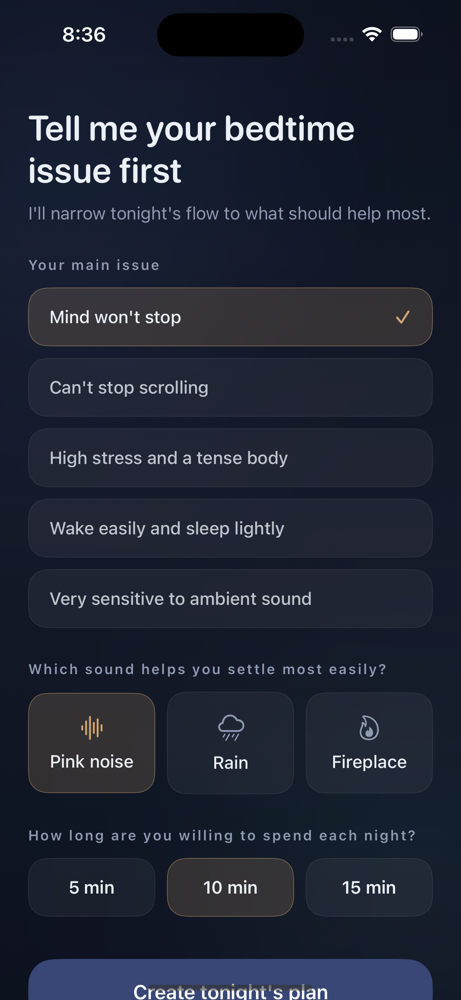
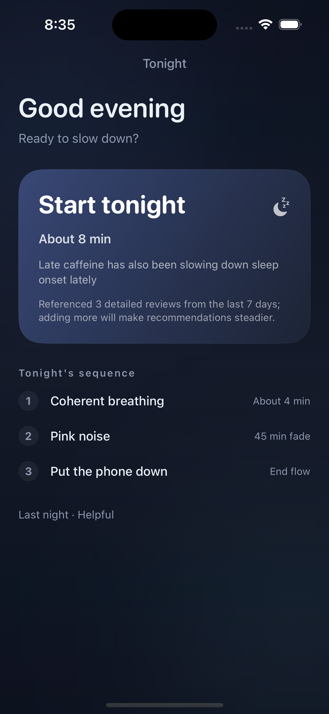
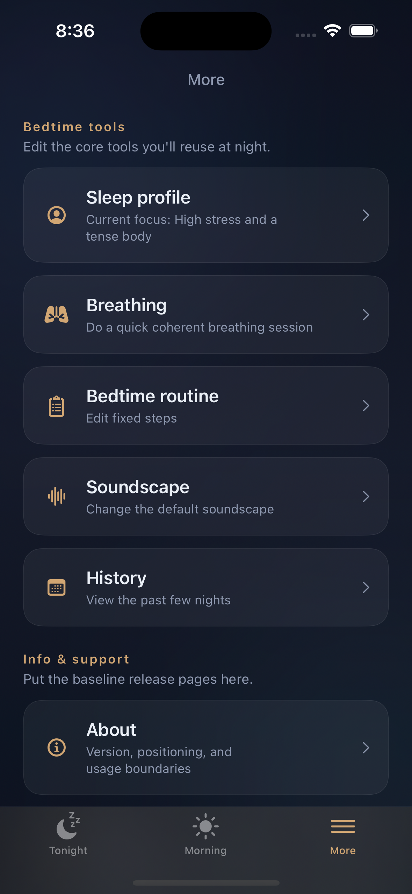
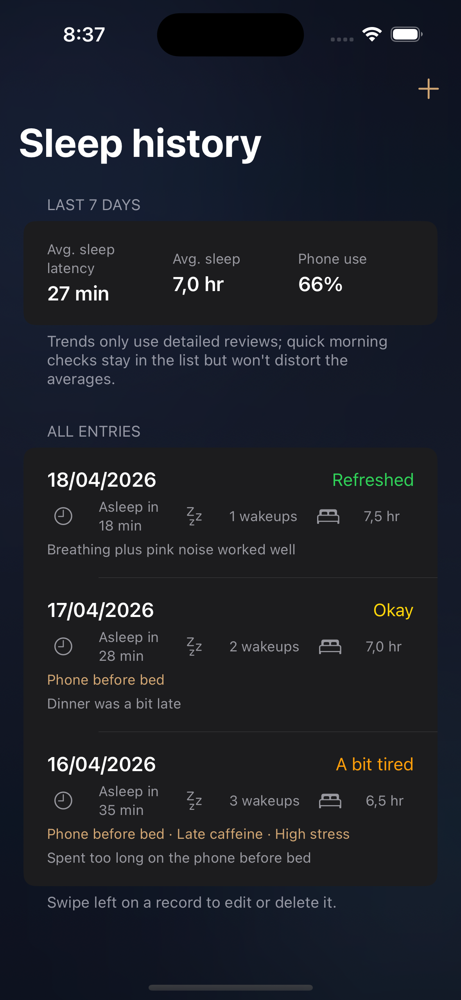
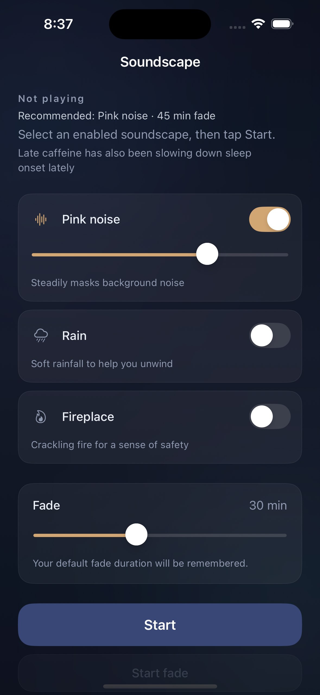

# Sleep Assistant

Sleep Assistant is a lightweight iOS bedtime companion for the last few minutes before sleep.

Instead of trying to be an all-in-one tracker, it narrows the experience to one short nightly path:

`Tonight -> Breathing -> Soundscape -> Phone Down -> Morning Review`

It is built with SwiftUI, works offline, stores data locally, and is designed for low-friction bedtime use rather than dashboards first.

## Screens

<p align="center">
  
  
  
</p>
<p align="center">
  
  
</p>

## What The Product Does

- Narrows bedtime down to a short, guided flow instead of a complex sleep dashboard.
- Builds a nightly recommendation from a simple sleep profile plus recent detailed reviews.
- Includes guided breathing, built-in soundscapes, fade-out timing, and a reusable bedtime routine.
- Separates quick morning check-ins from detailed reviews so trend summaries stay more trustworthy.
- Keeps user data local on-device with no login, analytics, or cloud dependency.

## Core Experience

### 1. Personalized setup

The app starts by asking what usually blocks sleep: racing thoughts, phone scrolling, stress, light sleep, or sound sensitivity.

### 2. A short nightly plan

The `Tonight` screen gives one focused recommendation for breathing, sound, and wind-down length, with a short explanation of why.

### 3. Low-friction bedtime tools

The `More` area keeps reusable tools in one place: sleep profile, breathing, bedtime routine, soundscape, history, and release-ready support pages.

### 4. Trust-building history

The `History` screen shows recent entries and makes it clearer which trends come from detailed reviews instead of quick subjective check-ins.

### 5. Built-in soundscapes

The soundscape screen supports pink noise, rain, and fireplace audio with a remembered fade duration and a recommendation that matches the nightly plan.

## Privacy

- Data is currently stored locally on-device.
- The app includes a `PrivacyInfo.xcprivacy` manifest for `UserDefaults` usage.
- There are no ads, analytics SDKs, accounts, or cloud sync flows in the current build.

Before release, real public support and privacy URLs still need to be filled in `sleep/AppMetadata.swift`, and App Store Connect privacy answers should match the in-app privacy page.

## Tech

- SwiftUI
- AVAudioEngine-generated soundscapes
- UserDefaults local persistence
- iOS 16.0+

## Run Locally

```bash
xcodebuild -project sleep.xcodeproj -scheme sleep -sdk iphonesimulator -destination 'platform=iOS Simulator,name=iPhone 16' build
```

Open `sleep.xcodeproj`, select the `sleep` scheme, and run on iOS 16 or later.

For deterministic screenshot states, the app also supports:

```bash
xcrun simctl launch booted lizhanbing.sleep --preview-screen tonight
```

Available preview screens: `onboarding`, `tonight`, `more`, `history`, `soundscape`.

## Status

This is an actively iterated product prototype moving toward App Store readiness.

## License

MIT
